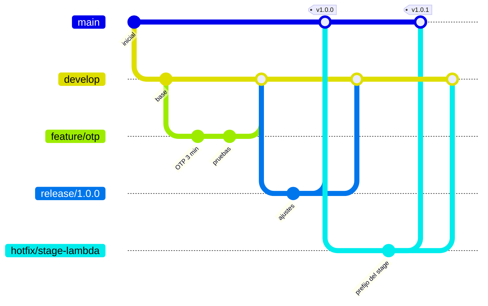

# Cómo se trabaja en este repositorio

Modelo de ramas **Gitflow** con integración y despliegue continuos en GitHub
Actions.

## Ramas

| Rama | Vida | Para qué |
|---|---|---|
| `main` | permanente | Refleja **producción**. Cada commit aquí es una versión desplegada y etiquetada. |
| `develop` | permanente | Rama de **integración**. Acumula lo terminado hasta que se prepara una versión. |
| `feature/*` | temporal | Una funcionalidad. Nace de `develop` y vuelve a `develop`. |
| `release/*` | temporal | Preparación de una versión: ajustes finales y documentación. De `develop` a `main`. |
| `hotfix/*` | temporal | Corrección urgente sobre producción. De `main` a `main` **y** a `develop`. |



## El ciclo, en comandos

**Una funcionalidad nueva**

```bash
git switch develop && git pull
git switch -c feature/descarga-masiva

# … trabajar, con pruebas …
npm test -w backend

git push -u origin feature/descarga-masiva
gh pr create --base develop --title "Descarga masiva de evidencias"
```

El pull request no se puede fusionar hasta que el CI pase. Al fusionarlo se
borra la rama.

**Una versión**

```bash
git switch -c release/1.1.0 develop
# ajustar versión y notas de la entrega
gh pr create --base main --title "Release 1.1.0"
# al fusionarlo, el CD despliega solo
git tag -a v1.1.0 -m "Descarga masiva de evidencias" && git push --tags
git switch develop && git merge main   # devolver los ajustes a develop
```

**Una corrección urgente**

```bash
git switch -c hotfix/1.0.1 main
# corregir, con la prueba que evita la regresión
gh pr create --base main --title "Hotfix: prefijo del stage en Lambda"
# fusionar también en develop, o la corrección se pierde en la próxima release
```

## Integración continua

[`.github/workflows/ci.yml`](.github/workflows/ci.yml) se ejecuta en cada push a
`main` y `develop`, y en cada pull request hacia ellas. Tres trabajos en
paralelo:

| Trabajo | Qué comprueba |
|---|---|
| **Backend** | Tipos, las 204 pruebas y el umbral de cobertura. Levanta **DynamoDB Local** como servicio, así que las pruebas de integración del adaptador se ejecutan de verdad y no se omiten. |
| **Frontend** | Tipos, las 66 pruebas, el umbral de cobertura y que los **tres bundles** de Module Federation compilen. |
| **Infraestructura** | `sam validate --lint` sobre la plantilla. |

Los umbrales de cobertura viven en los `jest.config.js`, no en el workflow: si
la cobertura baja del 60 % global —o del 90 % en dominio y aplicación—, las
pruebas fallan solas, en CI y en local por igual.

## Despliegue continuo

[`.github/workflows/cd.yml`](.github/workflows/cd.yml) se dispara al fusionar en
`main`. Vuelve a ejecutar el CI completo, despliega la API con SAM, compila los
microfrontends contra la URL real de la API y los publica en S3. Termina
comprobando que lo desplegado responde: si `/api/salud` o el frontend no
devuelven 200, el despliegue se marca como fallido.

### Autenticación sin secretos

No hay llaves de AWS guardadas en el repositorio. Se usa **OIDC**: GitHub emite
un token firmado por cada ejecución y AWS entrega credenciales temporales solo
si ese token viene de este repositorio y de la rama `main`.

El rol lo crea [`infra/github-oidc.yaml`](infra/github-oidc.yaml), con permisos
acotados a los servicios que el stack usa —no `AdministratorAccess`— y capaz de
administrar únicamente los roles cuyo nombre empieza por `aprobaciones-`.

```bash
aws cloudformation deploy --template-file infra/github-oidc.yaml \
  --stack-name aprobaciones-github-oidc --capabilities CAPABILITY_NAMED_IAM
gh variable set AWS_ROLE_ARN --body "<ArnRol que devuelve el stack>"
```

El ARN es una **variable**, no un secreto: sin un token OIDC válido de este
repositorio no sirve de nada.

## Convención de commits

Asunto en imperativo, sin punto final y por debajo de 72 caracteres; cuerpo
explicando **por qué**, no qué —el diff ya dice qué—. En español, como el resto
del proyecto.

```
Corrige el prefijo del stage en el handler de Lambda

Con un stage con nombre, API Gateway entrega rawPath con el stage delante,
así que ninguna ruta coincidía y todo respondía 404. El fallo solo aparecía
desplegado: las pruebas construían el evento con el stage $default.
```
