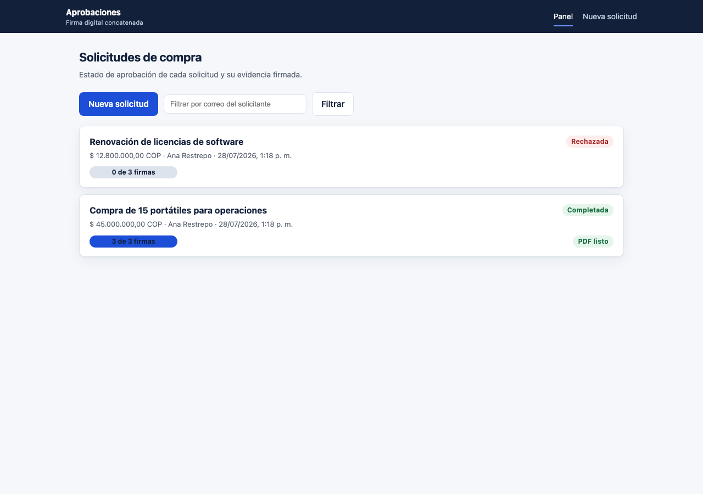
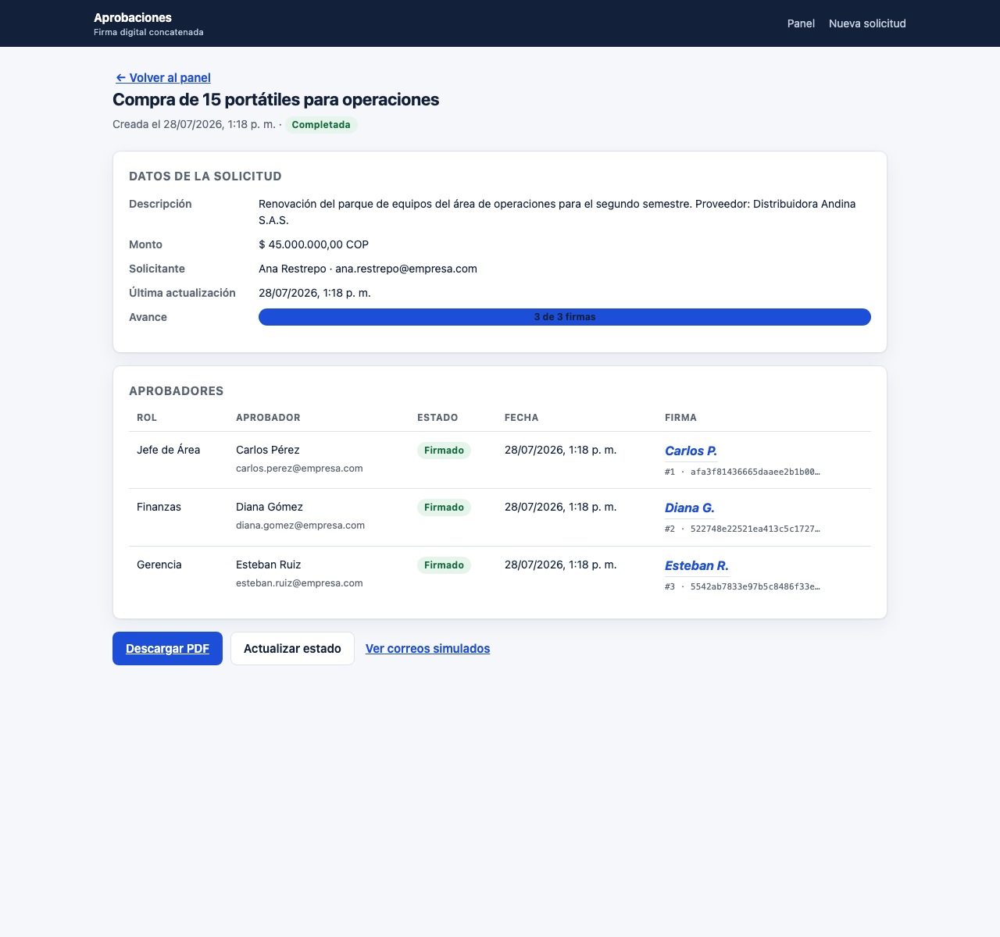
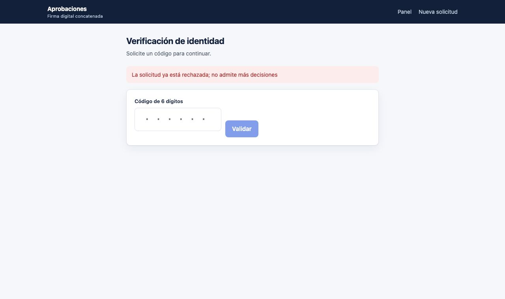
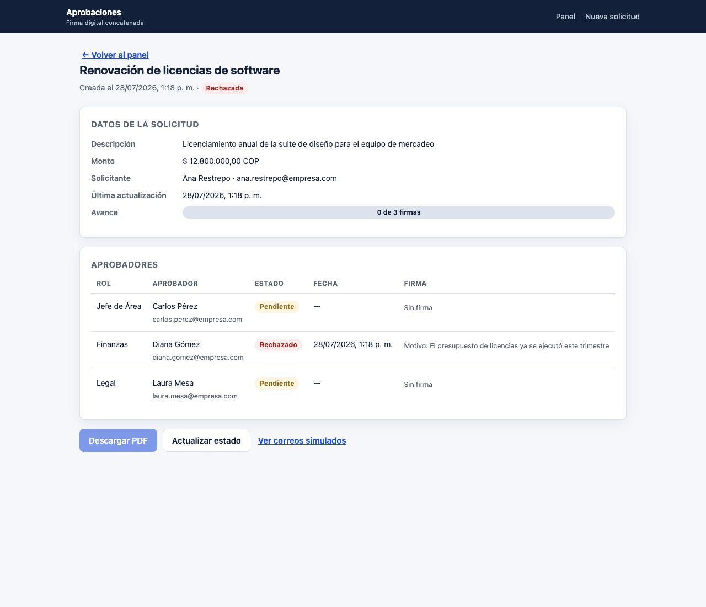
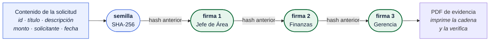
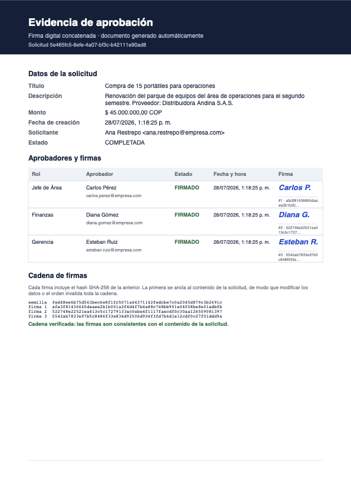
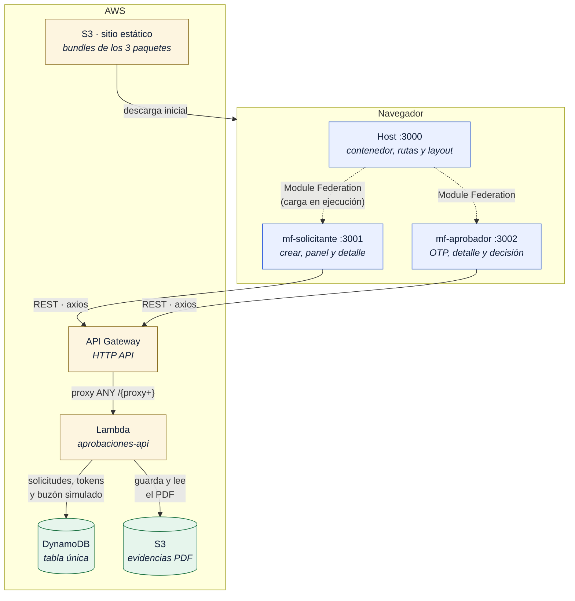
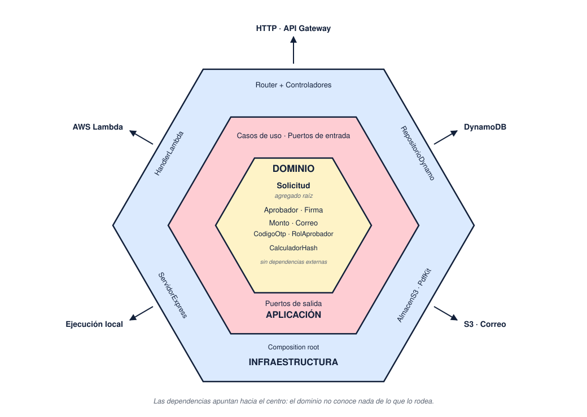
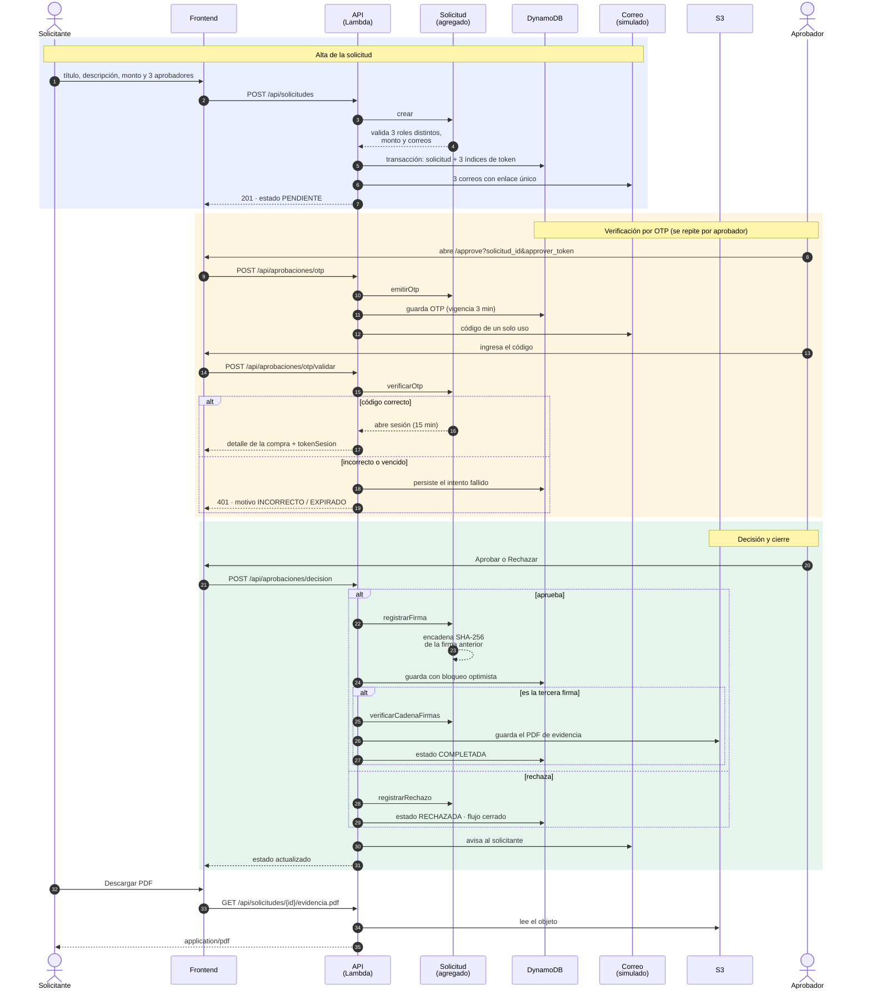

# Flujo de aprobaciones con firma digital concatenada

[](https://github.com/ssalaza7/aprobaciones-firma-digital/actions/workflows/pipeline.yml)

Aplicación web donde un **solicitante** crea una solicitud de compra y tres
**aprobadores** de roles distintos la firman —cada uno validando su identidad con
un OTP de 3 minutos— hasta producir un **PDF de evidencia** con las tres firmas
encadenadas.

Backend serverless (AWS Lambda + API Gateway + DynamoDB + S3) en TypeScript con
**arquitectura hexagonal**; frontend en **React con microfrontends** federados por
webpack 5.

| | |
|---|---|
| Backend | TypeScript · Node 20+ · pdfkit · AWS SDK v3 · Jest |
| Frontend | React 18 · React Router 6 · axios · webpack 5 (Module Federation) · Testing Library |
| Infraestructura | AWS SAM: Lambda + API Gateway (HTTP API) + DynamoDB + S3 |
| CI/CD | GitHub Actions · Gitflow · despliegue con OIDC, sin llaves guardadas |
| Pruebas | **204 backend** (98 % líneas) · **66 frontend** (91 % líneas) — mínimo pedido: 60 % |

## Desplegado y funcionando

| | |
|---|---|
| **Aplicación** | http://aprobaciones-frontend-dev-779715474515.s3-website-us-east-1.amazonaws.com |
| Región | `us-east-1` |

Para recorrer el flujo: cree una solicitud, abra *Ver correos simulados* en el
detalle y copie el enlace de un aprobador. El OTP aparece en pantalla porque el
stack está desplegado con `ExponerOtp=true`.



---

## Índice

1. [Qué hace, en concreto](#qué-hace-en-concreto)
2. [Firmas concatenadas](#firmas-concatenadas)
3. [Arquitectura](#arquitectura) — diagramas de componentes y hexagonal
4. [Flujo completo, paso a paso](#flujo-completo-paso-a-paso) — diagrama de secuencia
5. [Cómo ejecutarlo](#cómo-ejecutarlo)
6. [Cómo probar el flujo completo](#cómo-probar-el-flujo-completo)
7. [API](#api)
8. [Pruebas](#pruebas)
9. [Despliegue en AWS](#despliegue-en-aws)
10. [Integración y despliegue continuos](#integración-y-despliegue-continuos)
11. [Supuestos y decisiones](#supuestos-y-decisiones)
12. [Qué no está incluido](#qué-no-está-incluido)

---

## Qué hace, en concreto

1. **Alta.** El solicitante ingresa título, descripción, monto y tres aprobadores
   con **roles distintos** (catálogo cerrado: Jefe de Área, Finanzas, Compras,
   Legal, Gerencia). La solicitud nace `PENDIENTE`.
2. **Enlaces.** El sistema genera un **token único (UUID) por aprobador** y envía
   por correo —simulado— un enlace con la forma que pide el enunciado:
   `…/approve?solicitud_id=1234&approver_token=ABCDEF`.
3. **OTP.** Al abrir el enlace se emite un código de 6 dígitos **válido 3 minutos**
   y se envía al correo del aprobador. Con el código correcto —y solo entonces— se
   muestra el detalle de la compra.
4. **Decisión.** El aprobador **firma** (queda `FIRMADO` con nombre y fecha) o
   **rechaza** (la solicitud pasa a `RECHAZADA` y el flujo se cierra para todos).
5. **Seguimiento.** El panel del solicitante muestra el estado de cada aprobador:
   Pendiente / Firmado + fecha / Rechazado + fecha.
6. **Evidencia.** Con las tres firmas el backend genera el PDF, lo guarda en S3
   (o en disco, en local), la solicitud pasa a `COMPLETADA` y el frontend habilita
   **Descargar PDF**.

| Detalle de la solicitud | Pantalla del aprobador |
|---|---|
|  |  |
| Las tres firmas, con su posición en la cadena y su hash | El OTP se pide al abrir el enlace; hasta validarlo no se ve la compra |

Y el camino de rechazo, que cierra el flujo para todos:



---

## Firmas concatenadas

El enunciado pide "firma digital **concatenada**", así que está implementado
literalmente: las firmas forman una cadena de hashes al estilo de un libro mayor.

```
semilla = SHA256( id | título | descripción | monto | solicitante | fecha )
firma 1 = SHA256( "FIRMA" | id | 1 | aprobador | rol | correo | fecha | semilla )
firma 2 = SHA256( "FIRMA" | id | 2 | aprobador | rol | correo | fecha | hash(firma 1) )
firma 3 = SHA256( "FIRMA" | id | 3 | aprobador | rol | correo | fecha | hash(firma 2) )
```

Consecuencias prácticas:

- **Alterar una firma invalida las siguientes.** Cambiar la fecha de la firma 2
  rompe la verificación de la 2 y la 3.
- **Alterar la solicitud invalida toda la cadena**, porque el primer eslabón está
  anclado al contenido: si alguien edita el monto directamente en DynamoDB, la
  evidencia lo delata.
- **El orden de firma queda registrado** y es verificable, no solo la fecha.



El PDF imprime la cadena completa y declara si la verificación pasó. Ese
comportamiento está cubierto por pruebas: ver
[`Solicitud.test.ts`](backend/test/domain/Solicitud.test.ts) ("detecta la
manipulación de una firma", "detecta la manipulación del contenido").

El dominio decide **qué** se firma y **cómo** se enlaza; el algoritmo concreto
(SHA-256) entra por un puerto ([`CalculadorHash`](backend/src/domain/model/CalculadorHash.ts)),
de modo que el modelo no importa `node:crypto`.



---

## Arquitectura

### Diagrama de componentes

Qué piezas existen desplegadas y cómo se comunican.



El bucket de evidencias es **privado**: el PDF no se descarga de S3 sino a través
de la API, que es quien decide si puede entregarse. Los microfrontends se cargan
en **tiempo de ejecución**, no en compilación: el host solo conoce la URL del
`remoteEntry.js` de cada remoto.

### Backend: hexagonal (puertos y adaptadores)

<p align="center">
  
</p>

```
backend/src/
├── domain/                        # Modelo puro. Cero dependencias de framework.
│   ├── model/                     #   Solicitud (agregado raíz), Aprobador,
│   │                              #   Monto, Correo, CodigoOtp, RolAprobador
│   └── exception/                 #   Errores de negocio, sin saber de HTTP
│
├── application/                   # Casos de uso. Orquestan; no deciden reglas.
│   ├── port/in/                   #   Lo que la aplicación ofrece
│   ├── port/out/                  #   Lo que la aplicación necesita
│   ├── dto/                       #   Vistas: lo que sale por la API
│   └── service/                   #   Implementación de los casos de uso
│
└── infrastructure/                # Todo lo reemplazable.
    ├── adapter/in/http/           #   Router, controladores, mapeo de errores
    ├── adapter/in/lambda/         #   Handler de API Gateway
    ├── adapter/in/express/        #   Servidor local (mismo router)
    ├── adapter/out/persistencia/  #   DynamoDB · memoria
    ├── adapter/out/almacen/       #   S3 · sistema de archivos
    ├── adapter/out/pdf/           #   pdfkit
    ├── adapter/out/notificacion/  #   Correo simulado (memoria · DynamoDB)
    └── config/                    #   Composition root
```

Las dependencias apuntan **hacia adentro**. Consecuencias visibles en el código:

- **Un solo enrutador para dos entornos.** Los controladores se escriben contra
  un contrato HTTP propio ([`tipos.ts`](backend/src/infrastructure/adapter/in/http/tipos.ts));
  el handler de Lambda y el servidor Express solo traducen. La misma lógica corre
  en AWS y en `localhost` sin ramas `if (esLambda)`.
- **Correr sin AWS es cambiar una variable de entorno**, no un branch: el
  composition root elige DynamoDB o memoria, S3 o disco.
- **Las reglas se prueban sin infraestructura.** "Tres roles distintos", "un
  rechazo cierra el flujo", "el OTP vence a los 3 minutos" son pruebas de
  milisegundos sobre objetos en memoria, con un reloj inyectado.

El agregado `Solicitud` contiene a sus tres aprobadores: se lee y escribe como una
sola unidad, así que la regla de las tres firmas nunca ve un estado a medias.

### Frontend: microfrontends con Module Federation

```
frontend/packages/
├── host/            :3000  Contenedor: layout, rutas y carga de los remotos
├── mf-solicitante/  :3001  Remoto: crear solicitud, panel y detalle
├── mf-aprobador/    :3002  Remoto: OTP, detalle de compra y decisión
└── shared/                 Cliente axios, tipos de la API y componentes comunes
```

Dos decisiones que vale la pena señalar:

- **Los remotos exponen componentes, no rutas, y no conocen `react-router`.**
  Reciben la navegación por props (`onAbrir`, `onCreada`, `onVolver`). El host es
  el único que decide URLs; cambiar de enrutador no toca los remotos.
- **Cada microfrontend arranca por su cuenta** (`npm run dev -w @aprobaciones/mf-aprobador`),
  con su propio `index.html`. Eso mantiene honesta la independencia: si un remoto
  necesitara al host para funcionar, dejaría de ser un microfrontend.

Si un remoto no está disponible, el host no se queda en blanco: un límite de error
lo aísla y explica cuál módulo falló
([`remotos.tsx`](frontend/packages/host/src/remotos.tsx)).

---

## Flujo completo, paso a paso



Cuatro detalles que el diagrama hace explícitos:

- El **OTP autentica una sola vez**; lo que autoriza la decisión es el
  `tokenSesion` que se emite al validarlo. El código nunca viaja en la firma.
- Los **intentos fallidos se persisten**, para que el bloqueo a los cinco
  intentos no se pueda esquivar reintentando.
- La firma se guarda **antes** de generar el PDF. Si la generación falla, la
  firma no se pierde: la evidencia se reintenta en la primera descarga.
- El **rechazo de uno cierra el flujo** para los demás.

---

## Cómo ejecutarlo

Requisitos: **Node 20+**. Docker solo si quiere usar DynamoDB local.

```bash
# 1. Backend (memoria + disco: no requiere AWS)
cd backend && npm install && npm run dev
# → http://localhost:4000
```

```bash
# 2. Frontend (host + los dos microfrontends)
cd frontend && npm install && npm run dev
# → http://localhost:3000
```

Abra <http://localhost:3000>. Con `EXPONER_OTP=true` (por defecto en local) la
pantalla del aprobador muestra el código, así que puede recorrer todo el flujo sin
salir del navegador.

### Variables de entorno del backend

| Variable | Por defecto | Para qué |
|---|---|---|
| `PUERTO` | `4000` | Puerto del servidor local |
| `PERSISTENCIA` | `memoria` | `memoria` o `dynamo` |
| `ALMACEN` | `archivos` | `archivos` o `s3` |
| `TABLA_DYNAMO` | `aprobaciones` | Nombre de la tabla |
| `DYNAMO_ENDPOINT` | — | Endpoint alterno (DynamoDB Local) |
| `BUCKET_EVIDENCIAS` | — | Bucket de los PDF |
| `DIRECTORIO_EVIDENCIAS` | `.datos/evidencias` | Carpeta de PDF en modo local |
| `URL_BASE_FRONTEND` | `http://localhost:3000` | Base del enlace de aprobación |
| `ORIGENES_PERMITIDOS` | `*` | CORS |
| `EXPONER_OTP` | `true` | Devuelve el OTP en la respuesta (**solo demo**) |

El frontend recibe `API_URL` en tiempo de compilación:
`API_URL=https://mi-api.execute-api… npm run build`.

### Con DynamoDB real, en local

```bash
docker compose -f infra/docker-compose.yml up -d
cd backend && npm run tabla:local && npm run dev:dynamo
```

La tabla se crea con el mismo esquema del `template.yaml`. En
<http://localhost:8001> hay una consola para inspeccionarla.

---

## Cómo probar el flujo completo

**Por la interfaz** (lo natural): cree una solicitud, abra *Ver correos simulados*
en el detalle, copie el enlace de un aprobador, valide el OTP que aparece en
pantalla y firme. Repita con los otros dos: al tercero aparece **Descargar PDF**.

**Por la API**, sin frontend:

```bash
# 1. Crear
curl -s -X POST http://localhost:4000/api/solicitudes -H 'Content-Type: application/json' -d '{
  "titulo": "Compra de 15 portátiles",
  "descripcion": "Renovación del parque de equipos de operaciones",
  "monto": 45000000,
  "solicitante": { "nombre": "Ana Restrepo", "correo": "ana@empresa.com" },
  "aprobadores": [
    { "nombre": "Carlos Pérez",  "correo": "carlos@empresa.com",  "rol": "JEFE_AREA" },
    { "nombre": "Diana Gómez",   "correo": "diana@empresa.com",   "rol": "FINANZAS" },
    { "nombre": "Esteban Ruiz",  "correo": "esteban@empresa.com", "rol": "GERENCIA" }
  ]}'
```

La respuesta trae `solicitud.id` y los tres `enlacesAprobacion`. Con un
`solicitud_id` y un `approver_token`:

```bash
# 2. Pedir el OTP (llega al buzón; con EXPONER_OTP=true también en "otpDemo")
curl -s -X POST http://localhost:4000/api/aprobaciones/otp \
  -H 'Content-Type: application/json' \
  -d '{"solicitud_id":"…","approver_token":"…"}'

# 3. Validarlo → devuelve el detalle de la compra y un tokenSesion
curl -s -X POST http://localhost:4000/api/aprobaciones/otp/validar \
  -H 'Content-Type: application/json' \
  -d '{"solicitud_id":"…","approver_token":"…","otp":"123456"}'

# 4. Firmar (o "RECHAZAR")
curl -s -X POST http://localhost:4000/api/aprobaciones/decision \
  -H 'Content-Type: application/json' \
  -d '{"solicitud_id":"…","approver_token":"…","session_token":"…","decision":"APROBAR"}'

# 5. Tras las tres firmas, la evidencia
curl -s -o evidencia.pdf http://localhost:4000/api/solicitudes/…/evidencia.pdf
```

Todo el buzón simulado está en `GET /api/mock-mail`.

---

## API

Contrato completo en [`docs/openapi.yaml`](docs/openapi.yaml): OpenAPI 3.0 con
ejemplos por operación, los servidores de prueba y una sección **Cómo probar**
dentro del propio documento.

**La forma más rápida de verificarla** es el script de extremo a extremo, que
recorre el flujo completo y comprueba cada paso:

```bash
./docs/probar-api.sh
```

Sin argumentos apunta a la API desplegada; con uno, a donde se le indique
(`./docs/probar-api.sh http://localhost:4000`). Crea una solicitud, comprueba
que un OTP incorrecto devuelve 401, registra las tres firmas, verifica la cadena
de hashes y descarga el PDF. Solo necesita `curl` y `python3`.

Para explorarla a mano, en Swagger UI:

```bash
docker run --rm -p 8080:8080 -e SWAGGER_JSON=/api/openapi.yaml \
  -v "$PWD/docs:/api" swaggerapi/swagger-ui
```

El mismo archivo se importa tal cual en Postman o Insomnia (*Import → OpenAPI*).

| Método | Ruta | Qué hace |
|---|---|---|
| `POST` | `/api/solicitudes` | Crear solicitud y enviar los tres enlaces |
| `GET` | `/api/solicitudes` | Listar (`?solicitante=correo` para filtrar) |
| `GET` | `/api/solicitudes/{id}` | Detalle con el estado de cada aprobador |
| `GET` | `/api/solicitudes/{id}/evidencia.pdf` | Descargar la evidencia |
| `POST` | `/api/aprobaciones/otp` | Emitir el OTP (3 minutos) |
| `POST` | `/api/aprobaciones/otp/validar` | Validar OTP y abrir sesión de firma |
| `POST` | `/api/aprobaciones/decision` | Aprobar (firmar) o rechazar |
| `GET` | `/api/mock-mail` | Buzón de correo simulado |
| `GET` | `/api/roles` | Catálogo de roles aprobadores |
| `GET` | `/api/salud` | Healthcheck |

Todos los errores comparten el mismo cuerpo: `{ codigo, mensaje, motivo? }`.
Los códigos de estado se derivan del tipo de error de dominio en un único lugar
([`manejadorErrores.ts`](backend/src/infrastructure/adapter/in/http/manejadorErrores.ts)):
`400` validación · `401` OTP o sesión · `404` no encontrado · `409` transición
inválida o conflicto de concurrencia.

---

## Pruebas

```bash
cd backend  && npm run test:cobertura
cd frontend && npm run test:cobertura
```

| | Pruebas | Sentencias | Ramas | Líneas |
|---|---|---|---|---|
| Backend | 204 | 98 % | 81 % | 98 % |
| Frontend | 66 | 91 % | 83 % | 91 % |

El umbral configurado es el 60 % que pide el enunciado; el dominio y la capa de
aplicación se exigen al 90 %, porque ahí está el riesgo real.

Qué cubre cada nivel:

- **Dominio** — reglas y casos borde: el OTP vence a los 180 s exactos, se bloquea
  al sexto intento, un rechazo cierra el flujo, la cadena detecta manipulación.
- **Aplicación** — los casos de uso con adaptadores en memoria y **reloj falso**:
  la expiración de 3 minutos se prueba sin esperar 3 minutos.
- **Adaptadores** — DynamoDB y S3 con cliente simulado (se afirma sobre el comando
  enviado), PDF real (se extrae el texto del documento y se verifica que están los
  datos, las firmas y la cadena).
- **Integración** — el flujo completo por la API REST con el composition root de
  producción, PDF de verdad incluido, tanto por Express como por el handler de
  Lambda (evento de API Gateway v2, respuesta en base64).
- **Contra DynamoDB real** — [`dynamoLocal.test.ts`](backend/test/integracion/dynamoLocal.test.ts)
  ejercita transacciones, índices y **bloqueo optimista** contra DynamoDB Local
  (dos firmas simultáneas: una gana, la otra recibe conflicto y no se pierde
  ninguna). Se omite solo si el contenedor no está levantado.
- **Frontend** — Testing Library sobre comportamiento observable, no sobre
  implementación: qué ve el usuario, qué se envía al backend y qué pasa cuando la
  API falla.

Dos defectos reales que aparecieron gracias a estas pruebas y quedaron corregidos:
la pantalla del aprobador pedía OTP aunque el enlace llegara incompleto, y el PDF
se dibujaba con el estado anterior al cierre (decía `PENDIENTE` en el documento que
certificaba el cierre).

---

## Despliegue en AWS

Desplegado en la región `us-east-1`:

| Recurso | Valor |
|---|---|
| Frontend (S3 website) | http://aprobaciones-frontend-dev-779715474515.s3-website-us-east-1.amazonaws.com |
| API | API Gateway (HTTP API) + Lambda `aprobaciones-api-dev` |
| Tabla DynamoDB | `aprobaciones-dev` |
| Bucket de evidencias | `aprobaciones-evidencias-dev-779715474515` |
| Stacks | `aprobaciones-firma-digital`, `aprobaciones-frontend` |

La URL de la API la imprime `sam deploy` como salida `UrlApi` del stack, y es la
que consume el frontend; no hace falta usarla a mano para probar el flujo.

Verificado en la nube de punta a punta: creación de la solicitud, los tres OTP,
las tres firmas encadenadas, generación del PDF en S3 y descarga por la API.

> **Sobre el frontend:** debería ir tras CloudFront con Origin Access Control
> —HTTPS, CDN y bucket privado— y así estaba escrito primero. La cuenta usada es
> nueva y AWS exige verificarla con soporte antes de permitir distribuciones de
> CloudFront, de modo que se desplegó como sitio web estático de S3, que es HTTP.
> La plantilla con CloudFront está lista en
> [`infra/frontend-cloudfront.yaml`](infra/frontend-cloudfront.yaml) y se puede
> aplicar en cuanto la cuenta quede habilitada. Efecto secundario de S3 website: las rutas
> profundas (`/approve`) devuelven el `index.html` con estado HTTP 404; el
> navegador las renderiza bien y la SPA funciona, pero el código no es 200.

Para reproducirlo desde cero, con credenciales configuradas (`aws configure`):

```bash
cd infra && sam build && sam deploy
```

`samconfig.toml` ya fija stack, región y parámetros, así que no hace falta el
modo `--guided`. La salida incluye `UrlApi`. Después, el hospedaje del frontend:

```bash
aws cloudformation deploy --template-file infra/frontend.yaml --stack-name aprobaciones-frontend --parameter-overrides Etapa=dev
```

Con las dos URL ya conocidas se compilan y suben los tres bundles:

```bash
cd frontend
API_URL=<UrlApi> URL_MF_SOLICITANTE=<UrlFrontend>/solicitante URL_MF_APROBADOR=<UrlFrontend>/aprobador npm run build
aws s3 sync packages/host/dist          s3://<bucket>/             --delete --exclude "solicitante/*" --exclude "aprobador/*"
aws s3 sync packages/mf-solicitante/dist s3://<bucket>/solicitante/ --delete
aws s3 sync packages/mf-aprobador/dist   s3://<bucket>/aprobador/   --delete
```

Y por último se reapunta el stack de la API al frontend, para que los enlaces del
correo y CORS usen el dominio definitivo:

```bash
cd infra && sam deploy --parameter-overrides "Etapa=dev UrlBaseFrontend=<UrlFrontend> ExponerOtp=true"
```

En un entorno real, `ExponerOtp=false`.

Lo que crea [`infra/template.yaml`](infra/template.yaml):

- **DynamoDB** — tabla única bajo demanda, cifrada, con PITR, TTL y dos GSI
  (por solicitante y por tipo). Sin `Scan` en ninguna consulta.
- **S3** — bucket privado, cifrado y versionado para las evidencias. Los PDF se
  sirven por la API, nunca directo desde el bucket.
- **Lambda** — una función proxy `ANY /{proxy+}` (arm64, Node 22). El enrutamiento
  vive en el código, que es el mismo del servidor local.
- **API Gateway HTTP API** — con CORS restringido al origen del frontend y log de
  acceso en JSON.

El empaquetado usa `BuildMethod: makefile` ([`backend/Makefile`](backend/Makefile)):
compila TypeScript, instala solo dependencias de producción y descarta Express y el
entrypoint local, que no viajan a la Lambda.

El paquete resultante pesa ~43 MB sin comprimir, de los que ~21 MB son el SDK de
AWS. El runtime de Node lo trae incorporado y se podría excluir, pero se
empaqueta a propósito: así la versión del SDK queda fijada por el
`package-lock.json` y no cambia bajo los pies cuando AWS actualiza el runtime. El
límite de Lambda son 250 MB descomprimidos.

**Step Functions** no se usó: el flujo no tiene orquestación de larga duración ni
pasos que coordinar entre servicios. Cada acción del aprobador es una transacción
corta y aislada sobre un agregado; introducir una máquina de estados añadiría
latencia y una segunda fuente de verdad del estado, que ya vive en el agregado.

---

## Integración y despliegue continuos

### Gitflow

| Rama | Vida | Para qué |
|---|---|---|
| `main` | permanente | Refleja **producción**. Cada commit aquí es una versión desplegada y etiquetada. |
| `develop` | permanente | Rama de **integración**, donde se acumula lo terminado. |
| `feature/*` | temporal | Una funcionalidad. De `develop` a `develop`. |
| `release/*` | temporal | Preparación de una versión. De `develop` a `main`. |
| `hotfix/*` | temporal | Corrección urgente. De `main` a `main` **y** a `develop`. |

`main` está protegida: exige pull request con el pipeline en verde, y no admite
force-push ni borrado. La entrega está etiquetada como
[**v1.0.0**](https://github.com/ssalaza7/aprobaciones-firma-digital/releases/tag/v1.0.0).
El ciclo completo, con sus comandos y el diagrama de ramas, está en
[`CONTRIBUTING.md`](CONTRIBUTING.md).

### Un solo pipeline

Integración y despliegue viven en el mismo flujo
([`pipeline.yml`](.github/workflows/pipeline.yml)), de modo que cada ejecución
lleva un único nombre y una numeración continua —`CI/CD pipeline #1`, `#2`…— en
lugar de dos historiales paralelos que cuadrar.

**Verificación** — en cada push a `main` o `develop` y en cada pull request,
tres trabajos en paralelo:

| Trabajo | Qué comprueba |
|---|---|
| Backend | Tipos, 204 pruebas y umbral de cobertura, con **DynamoDB Local** como servicio: las pruebas de integración del adaptador se ejecutan de verdad, no se omiten |
| Frontend | Tipos, 66 pruebas, cobertura y que los **tres bundles** de Module Federation compilen |
| Infraestructura | `sam validate --lint` sobre la plantilla |

Los umbrales viven en los `jest.config.js`, no en el workflow: si la cobertura
baja del 60 % global —o del 90 % en dominio y aplicación—, las pruebas fallan
solas, igual en CI que en local.

**Despliegue** — el trabajo `desplegar` se activa solo al integrar en `main` y
únicamente si los tres anteriores pasaron. Despliega la API con SAM, compila los
microfrontends contra la URL real que devuelve el stack, los publica en S3 y
comprueba que lo desplegado responde: si `/api/salud` o el frontend no devuelven
200, el despliegue se marca como fallido.

### Autenticación sin secretos

No hay llaves de AWS en el repositorio. Se usa **OIDC**: GitHub emite un token
firmado en cada ejecución y AWS entrega credenciales temporales solo si procede
de este repositorio y de `main`. El rol lo crea
[`infra/github-oidc.yaml`](infra/github-oidc.yaml), con permisos acotados a los
servicios del stack —no `AdministratorAccess`— y capaz de administrar únicamente
los roles cuyo nombre empieza por `aprobaciones-`.

Un detalle que costó encontrar y que la documentación habitual no recoge: GitHub
puede emitir el sujeto del token en **formato inmutable**, con el identificador
numérico del propietario y del repositorio incrustado
(`repo:usuario@49240031/repo@1315501885:...`). Cualquier política de confianza
escrita sobre nombres deja de coincidir. La de este proyecto restringe por las
reclamaciones `repository` y `ref`, que llegan en formato estable.

---

## Supuestos y decisiones

Lo que el enunciado no fijaba y hubo que decidir:

1. **Sin autenticación de usuarios.** No hay registro ni login. El solicitante se
   identifica escribiendo su nombre y correo; el panel filtra por correo. La
   autorización del aprobador es **posesión del token del enlace + OTP**, que es
   justo lo que describe el enunciado. En un sistema real esto iría detrás de un
   IdP (Cognito) y el token del enlace sería de un solo uso y firmado.
2. **`EXPONER_OTP=true` por defecto.** Sin esto no se puede evaluar el flujo sin
   leer logs. Es una decisión de demostración: en el despliegue se pasa `false` y
   el OTP solo existe en el buzón. La respuesta nunca lo incluye si está apagado.
3. **El OTP se guarda en claro.** Vive 3 minutos, se invalida al usarse y es una
   simulación. En producción se guardaría el hash con sal y se compararía en
   tiempo constante. El intento fallido **sí** se persiste, para que el bloqueo a
   los 5 intentos no se pueda esquivar reintentando.
4. **Sesión de 15 minutos tras validar el OTP.** El enunciado no dice qué pasa
   entre "ver el detalle" y "decidir". Pedir el OTP otra vez al firmar sería
   hostil; mantener el OTP vivo hasta la decisión rompería los 3 minutos. La
   solución es una sesión corta: el OTP autentica una vez, la sesión autoriza la
   decisión.
5. **Tres roles de un catálogo cerrado.** "Tres roles distintos" es verificable
   solo si los roles son un conjunto conocido; con texto libre, "Finanzas" y
   "finanzas " serían distintos.
6. **Estados de la solicitud: `PENDIENTE` / `COMPLETADA` / `RECHAZADA`.** "Firmado"
   es un estado del **aprobador**, no de la solicitud; mezclarlos haría ambiguo el
   estado global cuando hay una firma y dos pendientes.
7. **El monto se guarda en centavos** (entero). En dinero, `0.1 + 0.2 !== 0.3`
   también.
8. **El rechazo de uno cierra el flujo.** Es lo que espera una aprobación en
   cadena: si Finanzas rechaza, no tiene sentido pedirle la firma a Gerencia.
9. **La evidencia se reintenta.** Si la tercera firma se guarda pero el PDF falla,
   la solicitud no queda atascada: la primera descarga lo vuelve a generar. La
   firma nunca se pierde por un error del generador.
10. **Bloqueo optimista, no bloqueo explícito.** Dos aprobadores pueden firmar en
    el mismo segundo; la condición sobre `version` hace que uno reciba `409` y
    reintente, sin pesimismo ni tablas de locks.

---

## Qué no está incluido

Por alcance, no por olvido:

- **Autenticación y autorización** de usuarios reales.
- **Correo real.** El envío está simulado, como permite el enunciado. Cambiarlo
  es escribir un adaptador de `NotificadorPort` con SES; los casos de uso no se
  tocan.
- **CloudFront delante del frontend** (pendiente de que AWS verifique la cuenta).
- **Comprobación de CORS en el pipeline.** Hoy verifica que la API y el frontend
  respondan 200, pero eso no detecta un origen mal configurado: CORS lo aplica el
  navegador, no `curl`. Ya provocó un fallo real —el frontend desplegado no podía
  llamar a la API— que se corrigió fijando el origen en `samconfig.toml`.
- **Firma criptográfica con certificados** (PKI, X.509, sellado de tiempo
  cualificado). La cadena SHA-256 da integridad y orden verificables, que es lo
  que el ejercicio pide; no equivale a una firma electrónica cualificada.
- **Paginación** en el listado del panel.
- **Reintentos automáticos** ante conflicto de concurrencia: hoy la API devuelve
  `409` y el cliente reintenta.
