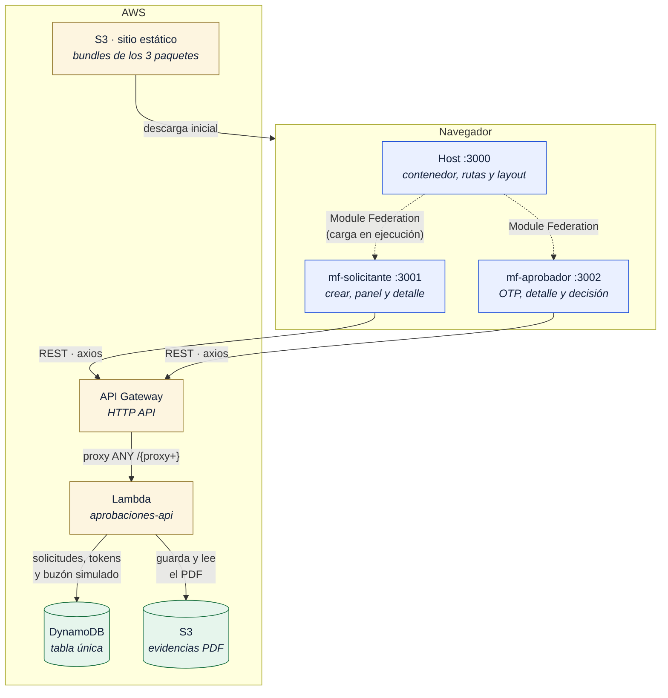
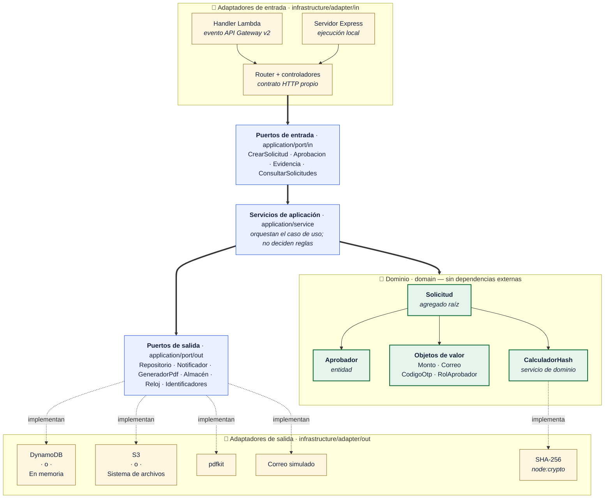
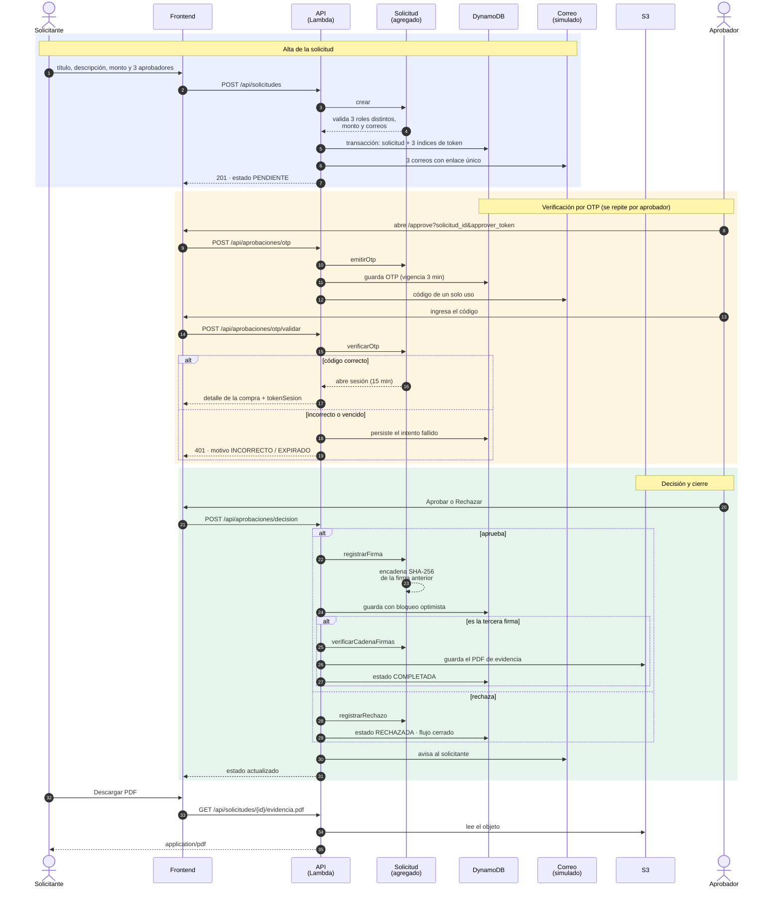
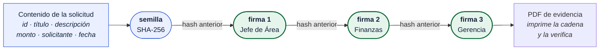

# Diagramas de arquitectura

Tres vistas del mismo sistema: **cómo se despliega** (componentes), **cómo se
estructura el código** (hexagonal) y **cómo transcurre el flujo** (secuencia).

---

## 1. Diagrama de componentes

Qué piezas existen desplegadas y cómo se comunican.

**Lo que conviene notar:**

- El bucket de evidencias es **privado**: el PDF no se descarga de S3 sino a
  través de la API, que es quien decide si el solicitante puede verlo.
- Los microfrontends se cargan **en tiempo de ejecución**, no en compilación:
  el host solo conoce la URL del `remoteEntry.js` de cada remoto.
- Una sola función Lambda atiende todas las rutas. El enrutamiento vive en el
  código, que es el mismo que usa el servidor local de desarrollo.

---

## 2. Arquitectura hexagonal (puertos y adaptadores)

Cómo está organizado el backend. Las flechas son **dependencias**, y todas
apuntan hacia adentro: el dominio no sabe que existe nada de lo que lo rodea.

> Las flechas gruesas (`==>`) son **dependencias del código**: siempre hacia el
> centro. Las punteadas son **implementaciones**: la infraestructura depende de
> los puertos, nunca al revés. Por eso el dominio, que está en el medio, no
> importa nada de lo que lo rodea.

**Por qué importa, en la práctica:**

| Consecuencia | Dónde se ve |
|---|---|
| La misma lógica corre en Lambda y en local | `handler.ts` y `servidor.ts` solo traducen hacia el mismo router |
| Correr sin AWS es cambiar una variable | `contenedor.ts` elige DynamoDB o memoria, S3 o disco |
| Las reglas se prueban en milisegundos | El OTP vence a los 3 minutos con un reloj inyectado, sin esperar |
| El dominio no importa `node:crypto` | SHA-256 entra por el puerto `CalculadorHash` |

Cada puerto de salida tiene **dos implementaciones** —una real y una local—, y
las pruebas usan la local. Esa simetría es lo que permite que la prueba de
integración recorra el flujo completo con el composition root de producción.

---

## 3. Diagrama de secuencia: el flujo completo

Desde que el solicitante crea la compra hasta que descarga el PDF firmado.

**Detalles del flujo que el diagrama hace explícitos:**

- El **OTP autentica una sola vez**; lo que autoriza la decisión es el
  `tokenSesion` que se emite al validarlo. El código nunca viaja en la firma.
- Los **intentos fallidos se persisten**, para que el bloqueo a los cinco
  intentos no se pueda esquivar reintentando.
- La firma se guarda **antes** de generar el PDF. Si la generación falla, la
  firma no se pierde: la evidencia se reintenta en la primera descarga.
- El **rechazo de uno cierra el flujo** para los demás.

---

## Cadena de firmas

El detalle de cómo se encadenan, que es el corazón del ejercicio.

Cada eslabón es `SHA-256("FIRMA" | id | secuencia | aprobador | rol | correo |
fecha | hash_anterior)`. Como el primero está anclado al contenido de la
solicitud, **modificar el monto en la base de datos rompe la verificación de las
tres firmas**, no solo de una.
